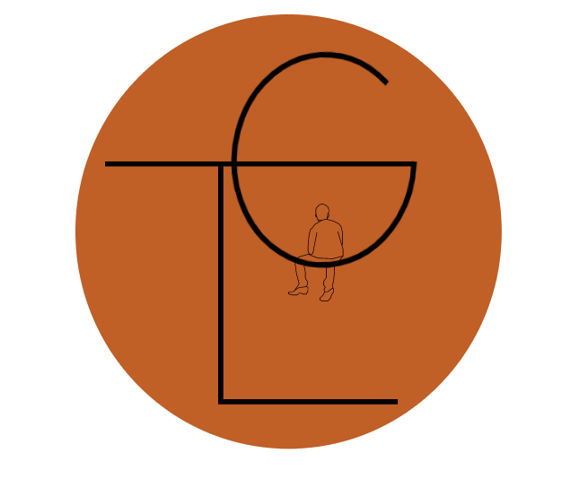

# The Little Guy 

## Description

Update 7-20-21: The Little Guy is now live! Check it out [here](https://the-little-guy.herokuapp.com/).

The Little Guy is a property management application for small business owners who have a small number of rental properties they are managing themselves. The Little Guy saves landlords money by allowing them to avoid the expensive fees charged by property management and real estate firms. The app is also a great resources for prospective tenants. People looking for a new place can easily apply for a property near them!

This is a full stack Mongo, Express, React and Node (MERN) application. MongoDB Atlas is used for the database. Instead of a RESTful API, we used Apollo Client/Server and GraphQL. Tailwind CSS is used for styling. We are using Cloudinary to host all images (profile and property). The front end of the website was built using Redux, with future progressive web app functionality in mind.

Development on the app continues, with many exciting new features planned for the future.

## Table of Contents

- [Installation](#installation)
- [Usage](#usage)
- [Contribute](#contribute)
- [Test](#test)
- [License](#license)
- [Future Features](#future-features)
- [Questions](#questions)

## Installation

Clone the repo and install all dependencies listed in the package.json files. You should be able to run npm install from the root directory, and NPM will do the rest. Make sure you have MongoDB installed and running on your machine, or be prepared to connect the app to your MongoDB Atlas account using an entry in .env.

## Usage

Sign up for an account - either as a landlord or tenant - and log in! You will see a full menu of options at the top in the navbar. As a tenant you can look for and apply for live at certain properties. As a landlord, you can add, modify, or delete property listings and review incoming applications for your properties. Both account types have access to a profile page where they can update their profile information, including an image, and change their password.

## Contribute

We are open to constructive criticism of the app! We have many features planned. Please reach out and let us know what you think.

## Test

You can either download and install the app into your own local development environment, or try out the live version. When testing, create an account of both types and test out all of the functions, such as add, delete, modify property. As a tenant, maybe try applying to some properties that you own as a landlord, then test to see if they show up. Just have fun with it!

## Future Features

Here are some features we are actively working on implementing:

- SocketIO for instant messaging between tenants and landlords
- Service repair ticket submission and ticket management
- Multiple property image capability
- Rent payment portal using Stripe
- Converting the app into a Progressive Web App

## License

Copyright (c) Zoe Chalk, Sam Gates, and Juan Santiago. All rights reserved.
Licensed under the [MIT](https://opensource.org/licenses/MIT) license.

## Questions

You can reach any of us using our GitHub contact info. Check out our GitHub pages!

- [Zoe Chalk](https://github.com/zchalk)
- [Sam Gates](https://github.com/sg0703)
- [Juan Santiago](https://github.com/Juawito)
